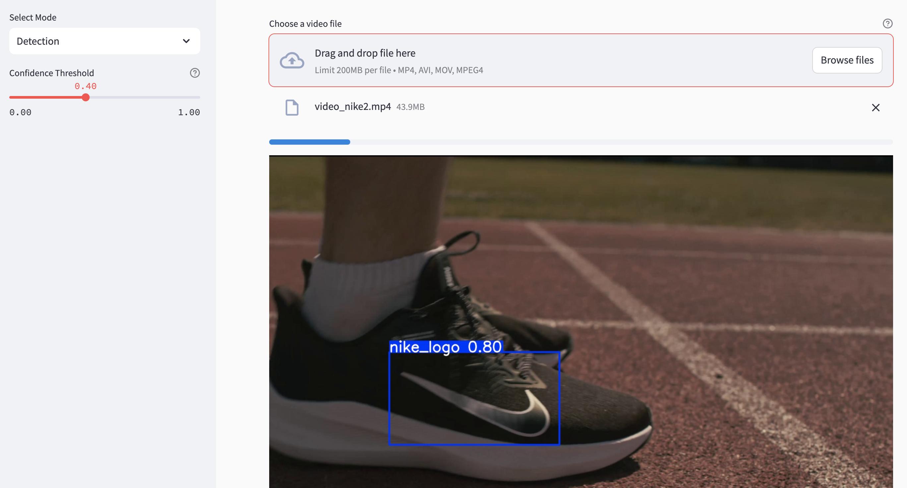
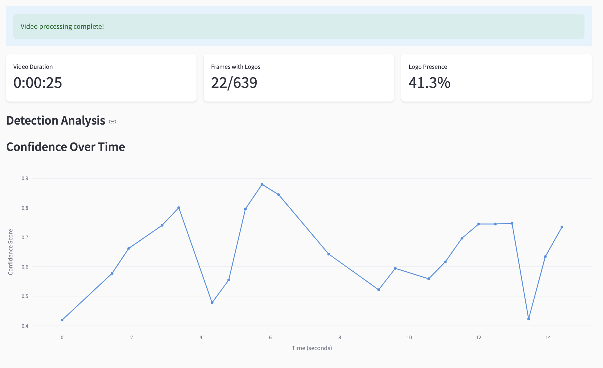

# Logo Detection System 🎯


A real-time logo detection system built with YOLOv8 and Streamlit, capable of detecting and tracking brand logos in both images and videos. The system includes training capabilities, database management, and analytics visualization.

## 🌟 Features

- Real-time logo detection in images and videos
- Support for multiple brand logos (Nike, Adidas, Puma)
- Interactive web interface built with Streamlit
- Database management for detection history
- Analytics and visualization of detection results
- Model training capabilities with hyperparameter optimization
- Docker support for easy deployment

## 🚀 Quick Start

### Using Docker (Recommended)

1. Clone the repository:
```bash
git clone https://github.com/yourusername/logo-detection-system.git
cd logo-detection-system
```

2. Build and run with Docker Compose:
```bash
docker-compose up --build
```

3. Access the application at `http://localhost:8501`

### Manual Installation

1. Clone the repository and create a virtual environment:
```bash
git clone https://github.com/yourusername/logo-detection-system.git
cd logo-detection-system
python -m venv venv
source venv/bin/activate  # On Windows: venv\Scripts\activate
```

2. Install dependencies:
```bash
pip install -r requirements.txt
```

3. Run the application:
```bash
streamlit run src/streamlit_app.py
```


## 📁 Project Structure

```
logo-detection-system/
├── src/
│   ├── inference/          # Detection logic
│   ├── storage/           # Database management
│   ├── training/          # Model training
│   └── streamlit_app.py   # Web interface
├── data/
│   ├── models/           # Trained models
│   └── detections/       # Stored detections
├── Dockerfile
├── docker-compose.yml
└── requirements.txt
```

## 🛠️ Configuration

Key configurations can be modified in `src/config.py`:

- `BRAND_CLASSES`: List of brands to detect
- `CONFIDENCE_THRESHOLD`: Detection confidence threshold
- `MODEL_PATH`: Path to the trained model
- `PRETRAINED_MODEL`: Base model for training

## 💾 Data Storage

The system uses SQLite for storing detection results and metadata. The database file is automatically created at the specified `DB_PATH`. Detection images are saved in the `DETECTIONS_DIR`.

## 🎯 Detection

- Upload images or videos through the web interface
- Adjust confidence threshold using the slider
- View detection results and analytics
- Access historical detections through the database management interface

## 🔧 Training

The system supports custom model training:

1. Prepare your dataset following YOLOv8 format
2. Use the training interface in the web app
3. Configure training parameters (epochs, optimization)
4. Monitor training progress


## 📊 Analytics

The system provides:
- Detection confidence visualization
- Brand distribution analysis
- Video processing statistics
- Historical detection data

## 🤝 Contributing

Contributions are welcome! Please feel free to submit a Pull Request.

## 📄 License

This project is licensed under the MIT License - see the LICENSE file for details.